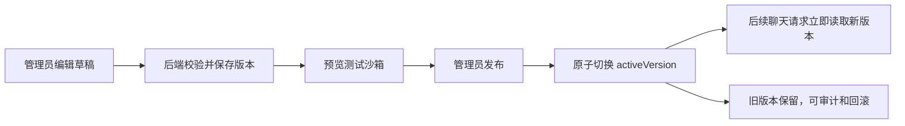

# AI Chat 前端接入与人设管理任务书

> 这是三项收尾工作中的核心任务。目标不仅是把聊天页面接到新 SSE 接口，还要让授权管理员能在前端维护一个 AI 的完整人设，经过预览后热发布，无需修改代码或重新发版。

## 1. 范围与现状

- 当前仓库未包含完成报告所提到的 `new-project-name` 前端目录；执行者必须先定位真实前端仓库/目录和技术栈，再按其现有请求封装、鉴权、路由和 UI 规范实现。
- 后端已有用户接口：角色列表、创建/查询会话、消息历史、SSE 发消息、记忆管理。
- 当前 `AiCharacterController` 只有启用角色列表，只返回 `id/name/description`；不存在人设管理、草稿、预览、发布、回滚 API。
- 当前人设由五段 prompt 和示例对话组成，数据虽在数据库里，但还不能安全地由前端管理。

## 2. 产品边界

前端可以配置的是业务人设：

- 角色名称、公开简介、头像、启用状态。
- 身份设定 `identityPrompt`。
- 性格设定 `personalityPrompt`。
- 语言风格 `speakingStylePrompt`。
- 互动规则 `interactionRulesPrompt`。
- 安全边界 `boundaryPrompt`（可编辑但必须通过后端最低安全规则校验）。
- Few-shot 示例对话：正例/反例、用户输入、理想回复。

前端绝不能读取或配置：

- `DEEPSEEK_API_KEY`、服务端 Authorization Header。
- 数据库/Redis/JWT Secret。
- 可绕过平台安全底线的隐藏系统规则。
- 任意模型 Base URL。模型继续固定为服务端的 `deepseek-v4-flash`。

## 3. 推荐架构：版本化人设发布



不要用“前端直接修改 `ai_character` 当前行”的简化方案。草稿必须与线上版本隔离，发布必须可追踪、可回滚。

## 4. 后端先补齐的管理 API

统一前缀建议为 `/admin/ai/characters`，必须复用项目管理员鉴权；普通登录用户访问一律返回 403。所有 DTO 使用 Bean Validation，禁止直接接收实体。

| 方法 | 路径 | 用途 |
|---|---|---|
| `GET` | `/admin/ai/characters` | 管理列表，含启用状态、当前版本、更新时间 |
| `POST` | `/admin/ai/characters` | 新建角色主记录和初始草稿 |
| `GET` | `/admin/ai/characters/{id}` | 角色详情、当前发布版和当前草稿摘要 |
| `PUT` | `/admin/ai/characters/{id}/draft` | 保存草稿，携带版本号做乐观锁 |
| `GET` | `/admin/ai/characters/{id}/versions` | 版本历史 |
| `GET` | `/admin/ai/characters/{id}/versions/{versionId}` | 查看不可变版本详情 |
| `POST` | `/admin/ai/characters/{id}/preview` | 使用草稿进行隔离预览聊天 |
| `POST` | `/admin/ai/characters/{id}/publish` | 发布指定草稿，需 `versionId/expectedVersion/changeNote` |
| `POST` | `/admin/ai/characters/{id}/rollback` | 以历史版本创建并发布新版本 |
| `PATCH` | `/admin/ai/characters/{id}/enabled` | 启用/停用；已有会话的行为必须明确 |

### 4.1 保存 DTO

至少包含：

```json
{
  "name": "小鹿",
  "description": "温柔、有活力的陪伴型朋友",
  "avatarUrl": "https://...",
  "identityPrompt": "...",
  "personalityPrompt": "...",
  "speakingStylePrompt": "...",
  "interactionRulesPrompt": "...",
  "boundaryPrompt": "...",
  "exampleDialogues": [
    {"type": "positive", "user": "在干嘛", "reply": "刚好在发呆，被你抓到了～你呢？"},
    {"type": "negative", "user": "在干嘛", "reply": "您好，我正在等待为您服务。"}
  ],
  "expectedVersion": 3
}
```

### 4.2 校验与限制

- 五段 prompt 必填，逐字段设置合理长度和总字符/Token 预算；超限返回具体字段错误。
- 示例对话必须是合法结构，数量和单条长度有限制，`type` 仅允许 `positive/negative`。
- 服务端固化不可删除的安全底线，再与角色 `boundaryPrompt` 组合；管理员内容不能覆盖底线。
- 防止 prompt 中包含控制标记注入内部模板；最终拼装仍由 `PersonaPromptAssembler` 完成。
- `PUT`/发布使用乐观锁，冲突返回 409 并携带最新版本信息。
- 写操作记录操作者、时间、变更说明；日志不打印完整 prompt。
- 不提供物理删除，角色只能停用。

### 4.3 预览接口语义

- 预览使用指定草稿版本，不切换 `activeVersion`。
- 默认不写入正式会话、长期记忆、关系状态和摘要，避免测试污染真实用户数据。
- 返回与正式聊天一致的 SSE 事件协议，便于复用前端流解析器。
- 支持输入临时测试消息和最近几轮临时上下文；不得允许指定其他真实用户 ID。
- 明确标记预览用量，便于成本统计与限流。

### 4.4 热更新读取

- `AiChatOrchestrator` 每次开始请求时解析一次角色的当前已发布版本，并在该请求生命周期内固定使用它。
- 发布提交后，后续请求立即读到新版本；如增加缓存，发布事务完成后必须按 `characterId` 精确失效，并设置短 TTL 兜底。
- SSE 生成过程中禁止因版本发布而中途切换 prompt。
- 建议在 `ai_message` 记录 `character_version_id`，便于复现某条历史回复；若采纳，另加迁移并更新报告。

## 5. 用户聊天前端接入

### 5.1 新接口契约

1. `GET /ai/characters`：角色选择。
2. `POST /ai/conversations`：创建会话，Body 以现有 `CreateConversationRequest` 为准。
3. `GET /ai/conversations?page=1&size=20`：会话列表。
4. `GET /ai/conversations/{id}/messages?cursor=&limit=30`：历史消息游标分页。
5. `POST /ai/conversations/{id}/messages`：SSE 流式发送，Body 以现有 `SendMessageRequest` 为准。
6. 记忆管理接口按现有 `AiMemoryController` 实际契约接入。

执行者必须先读取后端 DTO、VO 和 `SseEvent` 源码生成/维护前端类型，不能只依据本文猜字段。

### 5.2 SSE 客户端硬性要求

- 这是带 JSON Body 和鉴权的 `POST` SSE，原生 `EventSource` 不适用；使用 `fetch` + `ReadableStream`（或成熟且兼容现有栈的 fetch-event-source 实现）。
- 正确处理跨 TCP chunk 的 SSE 帧、`

` 分隔、多个 `data:` 行和 UTF-8 半字符；不得把每个网络 chunk 当成一条事件。
- 处理 `start/delta/usage/done/error`，以服务端 `SseEvent.type` 为准。
- `delta` 增量追加到同一条 Assistant 气泡；`done` 后落定；`error` 保留已收到的部分内容并允许重试。
- 页面离开、切换会话、重新发送时使用 `AbortController` 取消旧流。
- 每次发送生成稳定且唯一的 `clientMessageId`；网络重试复用同一个 ID，用户主动新发才生成新 ID。
- 防止重复点击和多流串线；状态按 `conversationId + clientMessageId` 隔离。
- 401 走统一登录失效处理，409/429/AI 错误码给出用户可理解的提示。

### 5.3 聊天体验

- 发送后立即显示用户消息和 Assistant 输入状态。
- 流式文字平滑更新，避免每 Token 导致整个列表重渲染。
- 自动滚动只在用户仍位于底部时生效；用户上滑阅读历史时不抢滚动位置。
- 历史消息向上游标分页，去重并保持滚动锚点。
- 刷新后能恢复会话和已完成/partial/failed 消息。
- 提供停止生成和失败重试；停止后保留部分回复。
- 不展示或存储 `reasoning_content`。

## 6. 人设管理前端

建议至少三个页面：

### 6.1 角色列表

- 名称、头像、启用状态、当前发布版本、草稿状态、最后修改人和时间。
- 新建、编辑、预览、版本记录、启用/停用入口。
- 明确区分“保存草稿”和“发布上线”。

### 6.2 人设编辑器

- 基础信息区：名称、简介、头像。
- 五段人设分区编辑，每段显示用途说明、字符数和校验错误。
- 示例对话使用结构化表单，可增删排序、区分正反例，禁止要求管理员手写 JSON。
- 自动保存草稿可选；必须处理版本冲突，不能静默覆盖他人修改。
- 提供“与当前线上版对比”的字段级 diff。
- 离开未保存页面时提示。

### 6.3 预览与发布

- 左侧或抽屉内提供多轮预览聊天，默认准备测试语句：`在干嘛`、情绪低落、分享喜讯、要求建议、追问记忆、边界/安全场景。
- 展示响应耗时和基础用量，但不展示隐藏 system prompt 与 Secret。
- 发布前显示变更 diff、变更说明输入框和确认弹窗。
- 发布成功后显示生效版本；版本历史支持查看与回滚确认。

## 7. 权限与审计

- 前端路由守卫只能改善体验，真正权限必须由后端校验。
- 至少区分普通用户和 AI 人设管理员；如项目已有 RBAC，新增权限点而非硬编码用户 ID。
- 所有读取完整 prompt、保存、发布、回滚、启停操作写审计记录。
- 管理 API 不得被普通 `/ai/characters` 响应间接泄露完整 prompt。
- 防 XSS：prompt 和示例内容按纯文本渲染，不使用未清洗的 `v-html`/`dangerouslySetInnerHTML`。

## 8. 测试要求

### 8.1 后端

- 普通用户访问管理 API 为 403，未登录为 401。
- 草稿保存不影响正式聊天；发布后下一次请求使用新版本。
- 预览不写正式消息/记忆/关系状态。
- 乐观锁冲突为 409；两个并发发布只有一个成功。
- 回滚生成可审计的新版本。
- 非法/超长 prompt、非法示例 JSON、空安全边界均被拒绝。
- 现有 43 个 AI 测试继续通过，并增加管理 API、版本服务和热更新测试。

### 8.2 前端

- SSE 分帧单测覆盖：半个 JSON 跨 chunk、多事件同 chunk、多行 data、中文 UTF-8 边界、服务端 error、主动 cancel。
- 状态测试覆盖：重复点击、切换会话、刷新恢复、相同 `clientMessageId` 重试。
- 管理台覆盖：字段校验、草稿保存、冲突处理、diff、预览、发布、回滚、权限拒绝。
- 至少完成桌面和移动端人工验收。

### 8.3 端到端验收场景

1. 管理员打开“小鹿”，修改语言风格并保存草稿。
2. 普通用户聊天仍使用旧版，证明草稿隔离。
3. 管理员用草稿连续测试“在干嘛”等场景，正式会话数据不增加。
4. 管理员发布，不重启后端、不重新构建前端。
5. 新发起的一轮聊天立即体现新版语言风格。
6. 管理员回滚，后续聊天恢复旧风格，版本和审计记录完整。
7. 普通用户无法访问或调用任何管理接口。

## 9. 实施顺序

1. 完成 V6 数据库版本化迁移。
2. 实现后端版本服务、管理 API、权限、审计和预览隔离。
3. 修改正式聊天读取已发布版本，补测试。
4. 在真实前端仓库实现统一 AI API 层和可靠 SSE 解析器。
5. 完成用户聊天页面接入。
6. 完成人设管理台、预览、diff、发布与回滚。
7. 联调、自动化测试、预发布验收。

## 10. 禁止事项

- 禁止把 DeepSeek Key 放到前端或通过管理接口返回。
- 禁止让前端直接连数据库或 DeepSeek。
- 禁止保存草稿即自动影响线上聊天。
- 禁止无权限校验的管理接口。
- 禁止覆盖式“回滚”导致历史版本丢失。
- 禁止为了接入前端重新引入旧 `/helloworld/*` 接口。
- 禁止泄露或展示 `reasoning_content`。

## 11. 交付物与完成定义

- 后端：V6 兼容代码、管理 API、版本发布/回滚、预览隔离、权限审计、测试。
- 前端：新 AI API 层、SSE 解析器、聊天页、人设管理页、版本页、预览页及测试。
- 接口文档：请求/响应、SSE 事件、错误码、权限说明。
- `AI_CHAT_FRONTEND_PERSONA_ADMIN_REPORT.md`：逐项记录实现文件、测试结果、端到端证据和未决风险。
- 达成“管理员在前端修改草稿→预览→发布→无需发版立即生效→可回滚”，且普通用户无越权能力，才算完成。

